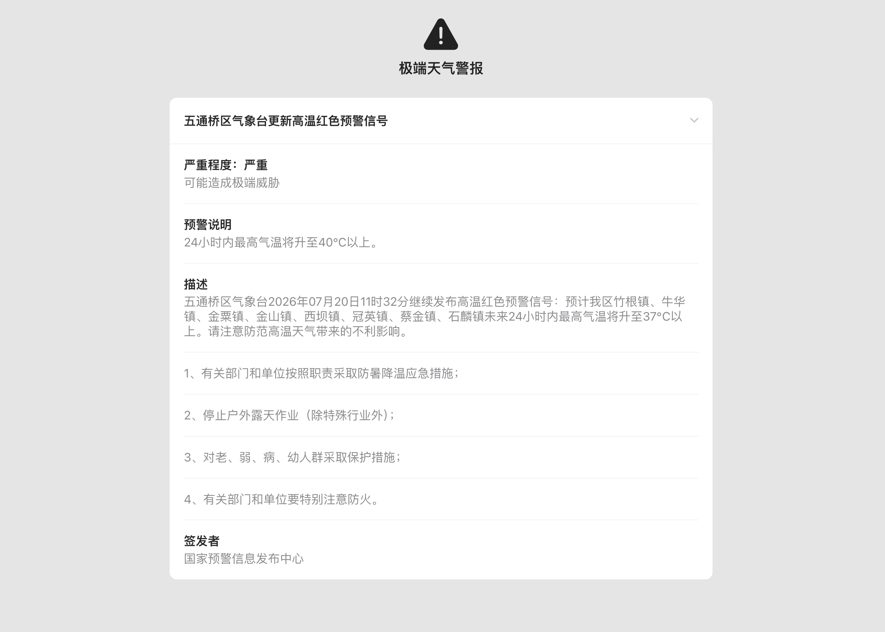

#  WeatherKit: 🌤 Alert Override

替换和风天气 (qweather.com) 预警页面，以 Apple WeatherKit 原生样式呈现预警信息。

## 效果

拦截 `qweather.com` 的严重天气预警页面，将原始 HTML 重新渲染为 Apple WeatherKit 风格的预警详情页，包括：

- 预警标题与类型图标
- 严重程度分级（轻微 / 中度 / 较重 / 严重）
- 预警描述与触发条件说明
- 防御指南
- 签发机构与区域信息
- 单条预警默认展开，多条预警全部折叠



## 安装

### 前置条件

- [Stash](https://stash.ws/)、[Surge](http://nssurge.com/)、[Loon](https://www.loon0.com/)、[EGERN](https://egernapp.com/) 或 [Quantumult X](https://quantumult.app/)（支持脚本响应的代理工具）

### Stash / Surge

在 Stash 或 Surge 中添加模块，输入以下 URL：

```
https://github.com/stellarhalo/WeatherKitAlert/releases/latest/download/WeatherKit.Alert.stoverride
```

### Surge（传统格式）

Surge 也可使用传统 `.sgmodule` 格式：

```
https://github.com/stellarhalo/WeatherKitAlert/releases/latest/download/WeatherKit.Alert.sgmodule
```

### Loon

在 Loon 中添加插件，输入以下 URL：

```
https://github.com/stellarhalo/WeatherKitAlert/releases/latest/download/WeatherKit.Alert.plugin
```

### EGERN

在 EGERN 中添加模块，输入以下 URL：

```
https://github.com/stellarhalo/WeatherKitAlert/releases/latest/download/WeatherKit.Alert.srmodule
```

### Quantumult X

在 Quantumult X 的配置文件中添加以下内容：

```
[rewrite_local]
^https?:\/\/www\.qweather\.com\/severe-weather\/ url script-response-body https://github.com/stellarhalo/WeatherKitAlert/releases/latest/download/alert.bundle.js

[mitm]
hostname = www.qweather.com
```

也可以通过订阅以下配置文件直接添加：

```
https://github.com/stellarhalo/WeatherKitAlert/releases/latest/download/WeatherKit.Alert.qx.conf
```

### 通用步骤

1. 根据你的工具添加对应的模块 / 配置
2. 确保 MITM 已开启并信任证书
3. 访问 `https://www.qweather.com/severe-weather/` 下的任意预警页面即可看到效果

### 自动更新

- **Surge / Stash**：模块使用 `script-providers`，脚本文件每 60 秒自动检查更新
- **其他工具**：重新加载插件 / 模块即可获取最新脚本

## 工作原理

```
用户访问 qweather.com 预警页面
        ↓
代理工具拦截响应
        ↓
src/index.js 解析 $response.body
        ↓
src/parser.mjs 用 div 计数法提取预警数据
        ↓
src/renderer.mjs 生成 Apple WeatherKit HTML
        ↓
替换原始响应体，返回给用户
```

### 项目结构

```
WeatherKitAlert/
├── src/
│   ├── index.js          # 入口脚本，拦截响应、调用解析与渲染
│   ├── parser.mjs        # div 计数 HTML 解析器，提取结构化预警数据
│   ├── renderer.mjs      # 生成 Apple WeatherKit 风格 HTML
│   └── types.d.ts        # TypeScript 类型定义 (AlertData)
├── template/
│   └── stash.alert.handlebars   # Stash 模块模板（Handlebars）
├── modules/
│   ├── WeatherKit.Alert.stoverride  # Stash 模块配置
│   ├── WeatherKit.Alert.sgmodule    # Surge 模块配置
│   ├── WeatherKit.Alert.plugin      # Loon 插件配置
│   ├── WeatherKit.Alert.srmodule    # EGERN 模块配置
│   └── WeatherKit.Alert.qx.conf     # Quantumult X 配置
├── dist/
│   └── alert.bundle.js   # 构建产物（CDN 分发）
├── rspack.config.mjs     # rspack 构建配置
└── package.json
```

## 开发

### 构建

```bash
npm install
npm run build              # 生产构建
npm run build:dev          # 开发模式（不压缩）
```

构建使用 **rspack**（非 webpack），输出到 `dist/alert.bundle.js`。

### 构建产物发布

1. 更新 `package.json` 和 `modules/*` 中的版本号
2. `npm run build` 生成 `dist/alert.bundle.js`
3. 将 `dist/alert.bundle.js` 与 `modules/` 下所有平台配置文件一同上传至 GitHub Releases
4. 删除旧 Release，避免 `/releases/latest/download/` 重定向混乱

## 技术要点

- **Div 计数解析**：`parser.mjs` 使用 `findMatchingClose()` 处理嵌套 `<div>`，不依赖 DOM 解析器
- **字符串拼接**：`renderer.mjs` 使用字符串拼接（`+`）而非模板字面量（`` ` ``），避免在 rspack 打包输出中产生反引号冲突
- **Apple CSS**：页面引用 Apple CDN 上的 `weather_alert.d0054c35839929383291.css`，无需本地维护样式
- **跨平台兼容**：脚本自动检测 Quantumult X 与 Surge/Stash/Loon/EGERN 的 API 差异，使用对应的 `$done()` 调用方式
- **无测试 / 无 lint 配置**：独立脚本模块，非标准库项目

## 兼容性

| 工具 | 支持 | 模块格式 |
|---|---|---|
| Stash | ✅ 原生支持 | `.stoverride` |
| Surge | ✅ 原生支持 | `.stoverride` / `.sgmodule` |
| Loon | ✅ 原生支持 | `.plugin` |
| EGERN | ✅ 原生支持 | `.srmodule` |
| Quantumult X | ✅ 配置订阅 | `.qx.conf` |

## 致谢

本项目最初基于 [NSRingo/WeatherKit](https://github.com/NSRingo/WeatherKit) 项目，原作者为 VirgilClyne、WordlessEcho、001，感谢他们的开创性工作。

本仓库为预警模块（Alert Override）的独立维护版本。

## 许可证

Apache-2.0
